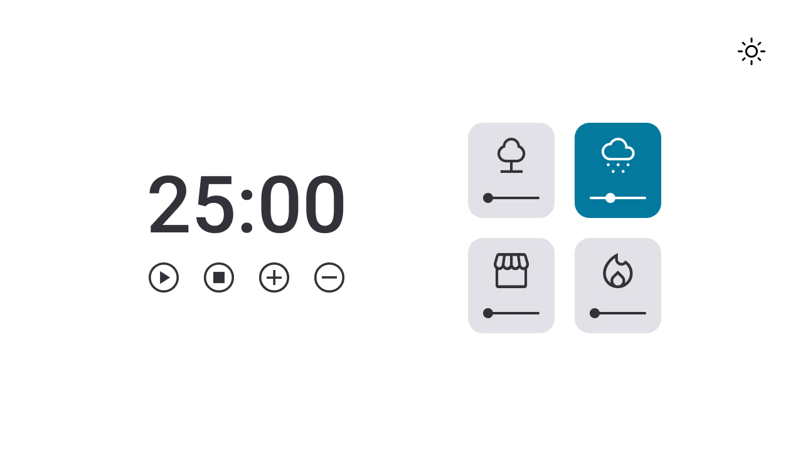
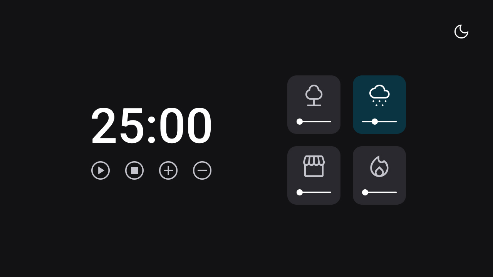

<h1>Pomodoro FocusTimer 2.0 - dark mode</h1>

 

<h2> O Projeto </h2>

O projeto foi desenvolvido como desafio do curso Explorer da Rocketseat. 
 

Ele consiste em um temporizador para foco, onde o usuário defini o seu tempo de estudo. Diferente da versão 2.0, essa conta com: 
- Dark mode
- Cards de sons ambientes com volume ajustável 

  

 

  

 

informações básicas que o usuário deve seguir para usar o FocusTimer2.0 dark mode:

- Funcionalidades dos botões (continuam as mesmas):
  - Play: aciona o timer;
  - Stop: para o timer;
  - +: aumenta em mais 5 minutos o tempo do timer;
  - -: diminui em 5 minutos o tempo do timer.

 

- Funcionalidade dos cards:
  - Podem ser selecionados mais de um card
  - O card selecionado muda de cor
    - começa a tocar o som específico dele
  - O volume do som pode ser ajustado
    - por padrão, quando o usuário clicar num card, o volume é iniciado em 50%.

 

- Funcionalidade do botão no canto superior direito:
  - Alterna entre o Dark Mode e o Light Mode.
  - o ícone se altera de acordo com o Mode que ele se encontra

 

Quer conferir o FocusTimer2.0 Dark mode? 

[Visite o projeto online]()

 

<h2> O intuito do projeto </h2>

O intuito do projeto foi colocar em prática os conhecimentos acerca de:

- HTML
- CSS
  - variáveis
  - grid-template-columns / grid-template-rows / grid-column / grid-auto-flow
  - margin / padding
  - position: relative / absolute
  - align-self / justify-self / justify-content
  - centralizar div com position/grid/flex/margin
  - ::before / :hover
  - transform / rotate()
  - responsividade / mobile first

- JavaScript
  - Variáveis
  - Utilização de DOM
  - Manipulação de eventos e callbacks
  - ES6 modules
  - Refatoração e Clean Code
  - padrão factory
  - injeção de dependências

 

<h2> Tecnologias </h2>

Foi utilizado as seguintes tecnologias para desenvolver esse projeto:

- HTML
- CSS
- JavaScript
- Git
- GitHub